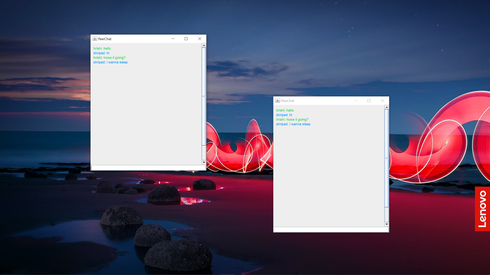

# P2P Messaging App
(This app was made for AP Computer Science Principles Create Project.)
  
  
  
  
  This app uses java's sockets to directly send strings directly from one IP address to another IP address. This app meets these AP Computer Science Principles requirements:
 
  In this Performance Task, you will be developing a program of your choice. 
    - Your development process should include iteratively designing, implementing, and testing your program. 
    - You are strongly encouraged to work with another student in your class on the development of your program code. 
    - Your program development must also involve a significant amount of independent work writing your program code, in particular, algorithm(s) and abstraction(s) that you select to use as part of your written response to describe how the program code segments help your program run.

  
Find the tutorial at [here](https://youtu.be/SLlduIVlykE)
  
